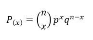

```{r setup, include=FALSE}
knitr::opts_chunk$set(echo = TRUE)
```

## R Markdown
```{r}
library(nycflights13)
library(tidyverse)
library(lubridate)
```


```{r}
glimpse(flights)
##glimpse(airports)

```
## Primera Parte

### A) Flights es una tabla de una base de datos que contiene información de los vuelos que han salido de cualquiera de los 3 aeropuertos de la ciudad de Nueva York en el año 2013 (hacia cualquier destino).

###  B) A continuación un gráfico de barras que representa la sumatoria de vuelos salientes de los aeropuertos de Nueva York a cada hora del día.

```{r}
Cantidad_hora <- data.frame(table(flights$hour))
colnames(Cantidad_hora) = c("Hora", "Cantidad")
Cantidad_hora <- Cantidad_hora %>% filter(Cantidad > 100)

gv <- ggplot(data = Cantidad_hora, 
            aes(x = Hora, 
                y = Cantidad / 1000,
                width = 0.666,
                fill = Hora)) +
  geom_bar(stat = "identity") +
  labs(title = "Vuelos Salientes de NYC", 
       subtitle = "durante el 2013",
       y = "Cantidad (en miles)",
       x = "Hora de salida") +
  theme_minimal() +
  theme(legend.position = "none")
gv
```

Se puede observar que a las 8 de la mañana es cuando mas vuelos parten de Nueva York y de medianoche a las 4am (inclusive) practicamente no hay salidas (con la excepción de que existió una partida a la 1am pero se elimina del gráfico pues no es apreciable dada las grandes diferencias de magnitudes)


### C) Gráfico de barras horizontal

Las Aerolineas más utilizadas, salientes de Nueva York se pueden observar a continuación, donde la más importante es United Air Lines.


```{r}
tf <- data.frame(table(flights$carrier))
colnames(tf) = c("carrier", "cantidad")
tf <- merge(x = tf, y = airlines, all.x = TRUE)
tf <- tf %>% arrange(desc(cantidad))
tf <- tf[,c(2, 3)]
t1_a = tf[1:7,]
t1_b = tf[8:nrow(tf),]
t1_c <- data.frame("name" = "Otras", 
                   "cantidad" = sum(t1_b$cantidad))

t1 = rbind(t1_a, t1_c)
t1$order <- seq(1, length(t1$cantidad))

t1 = t1 %>% mutate(porc = round(100 * cantidad / sum(cantidad), 2))
colnames(t1) = c("Cantidad", "Aerolinea","Orden", "Porcentaje")


```

```{r}

gh <- ggplot(data = t1, 
            aes(x = reorder(Aerolinea, -Orden), 
                y = Cantidad / 1000,
                width = 0.666,
                fill = Aerolinea)) +
  geom_bar(stat = "identity") +
  labs(title = "Vuelos Salientes de NYC durante el 2013", 
       x = "Aerolinea",
       y = "Cantidad de Vuelos (en miles)") +
  theme(legend.position = "none") +
  coord_flip()

gh

```

Para obtener los nombres de las aerolineas se tiene que 


### D) Gráfico de Pastel

Dado que se tienen 3 aeropuertos, a continuacion se muestra el porcentaje de vurlos salientes desde cada uno de los 3 aeropuertos. 

```{r}
porc_aeropuerto <- data.frame(table(flights$origin))
colnames(porc_aeropuerto) = c("faa", "cantidad")
porc_aeropuerto <- merge(x = porc_aeropuerto, y = airports, all.x = TRUE)
porc_aeropuerto <- porc_aeropuerto[,c(1,2,3)]
porc_aeropuerto <- porc_aeropuerto %>% mutate(porc = cantidad / sum(porc_aeropuerto$cantidad)) %>% arrange(desc(cantidad))
porc_aeropuerto$porc <- round(porc_aeropuerto$porc * 100 , 1)
porc_aeropuerto <- ungroup(porc_aeropuerto)
colnames(porc_aeropuerto) = c("faa", "Cantidad", "Aeropuerto", "Porcentaje")
porc_aeropuerto$order <- seq(1, length(porc_aeropuerto$Cantidad))

gp <- ggplot(data = porc_aeropuerto, 
            aes(x = "", 
                y = Porcentaje,
                fill = reorder(Aeropuerto, -order))) +
  geom_bar(width = 1, 
           size = 1, 
           color = "white", 
           stat = "identity") +
  geom_text(aes(label = paste0(Porcentaje, "%")),
            position = position_stack(vjust = 0.5), 
            color = "white") +
  labs(title = "Vuelos Salientes de NYC", fill = "Aeropuerto")  +
  coord_polar("y", direction = 1) +
  theme_void()

gp
```


## II Parte

### 1) Binomial

Suponga que el 30% de los estudiantes del ITCR son mujeres. Si se toma una muestra de 10
mujeres al azar.

#### a) Escriba la fórmula de la distribución que modela esta situación.

La ecuacion que describe la distribucion binomial es:





donde:


#### b) ¿Cuál es la probabilidad de que en la muestra haya al menos 4 mujeres?

```{r}
p <- 0.3
q <- 1-p
n <- 10
x <- 4
```

Como debe de haber 4 o mas entonces se debe realizar el acumulado de probabilidad de 4 a 10.

```{r}
sum(dbinom(seq(4,n), n, p))
```

ó realizar el acumulado de 0, 1, 2, 3 y restarlo de 1.

```{r}
1- sum(dbinom(c(0,1,2,3), n, p))
```

ó realizar el acumulado con la funcion pbinom y restarlo de 1.

```{r}
1- pbinom(3, n, p)
```

#### c) ¿Cuál es la probabilidad de que en la muestra haya más de 4 y a lo sumo 8 mujeres?

La probabilidad de que haya más de 4 y a lo sumo 8

```{r}
p <- 0.3
q <- 1-p
n <- 10
x <- c(5, 6, 7, 8)
```


```{r}
sum(dbinom(x, n, p))
```


#### d) ¿Cuál es la probabilidad de que haya exactamente 5 mujeres en la muestra?

La probabilidad de que haya exactamente 5 mujeres

```{r}
p <- 0.3
q <- 1-p
n <- 10
x <- 5
```


```{r}
dbinom(x, n, p)
```

#### e) Determine la media y la desviación estándar que se esperaría ver en la muestra.


```{r}
p <- 0.3
q <- 1-p
n <- 10
```

La media se obtine de asi:

```{r}
media <- n*p
media
```
y la varianza:

```{r}
varianza <- n*p*q
varianza
```


### 2) Hipergeométrica 

Constantemente, la gente que posee un vehículo vive quejándose de las fallas mecánicas que estos presentan, tanto, porque es un gasto tanto para sus bolsillos como por las implicaciones en la disponibilidad de uso.
Popularmente, se tiene la creencia de que una persona podría olvidarse de este tipo de imprevistos si tuviese la capacidad de pago para adquirir un vehículo nuevo de agencia, situación que no es tan cierta. Suponga que en Costa Rica, la compañía de autos A debe hacer efectiva su garantía para algunos usuarios que adquirieron de agencia, uno de sus autos modelo X. Sabiendo que para el mes de enero pasado, disponía de 30 vehículos de dicho modelo X en sus agencias donde 3 de ellos venía con un desperfecto de fábrica y que durante ese mes logró vender 8 de esos autos, realice lo siguiente:

#### a) Verifique que se cumple la condición para que sea hipergeométrica y escriba la ecuación de la distribución que modela esta situación

Se cumple la condición pues con cada vehículo vendido ya se tendria uno menos de donde escoger (además es un valor pequeño que es lo que la hipergeometrica pide).

La ecuación es la siguiente:


#### b) ¿Cuál es la probabilidad de que ninguno de los autos vendidos requiera la garantía durante el primer año?.

La probabilidad de que de los 8 autos vendidos, 8 salieran buenos es de:

```{r}
m <- 27
n <- 3
k <- 8
x <- 8
```

```{r}
dhyper(x, m, n, k)
```

#### c) Determine la probabilidad de que al menos dos de los autos vendidos requiera hacer uso de la garantía.


```{r}
m <- 27
n <- 3
k <- 8
x <- seq(0,5)
```

```{r}
1-sum(dhyper(x, m, n, k))
```


### 3) Geométrica 

Un juego consiste en gira runa ruleta que tiene 3 opciones de premio y 13 opciones no premio. Una persona que juegue la ruleta ganará si al girarla obtiene la opción “premio” antes del cuarto intento.

#### a) Escriba la fórmula de la distribución que modela esta situación


La ecuacion es la siguiente:


#### b) Calcule la probabilidad de si una persona gane en una jugada en la ruleta.

```{r}
q <- 2
premio <- 3
npremio <- 13
prob <- premio/(premio + npremio)
```

Entonces la probabilidad de gane en una jugada es de:

```{r}
pgeom(q,prob)
```


```{r}
m <- 27
n <- 3
k <- 8
x <- 8
sum(dbinom(seq(4,n), n, p))
```

